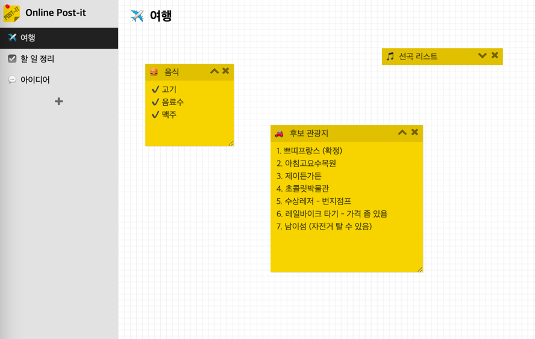

# 📒 svelte-post-it
- Simple Post-it Board using Svelte.
  - My first Svelte application.
- The data has been stored in web storage by using localStorage.
- https://yj-oh.github.io/svelte-post-it



## 🤹‍♀️ Getting Started
```
git clone https://github.com/yj-oh/svelte-post-it.git

yarn install

yarn start
```

## ⚙️ Firebase configuration
- root/.env
```
APP_API_KEY=
APP_AUTH_DOMAIN=
APP_PROJECT_ID=
APP_STORAGE_BUCKET=
APP_MESSAGING_SENDER_ID=
APP_APP_ID=
```
